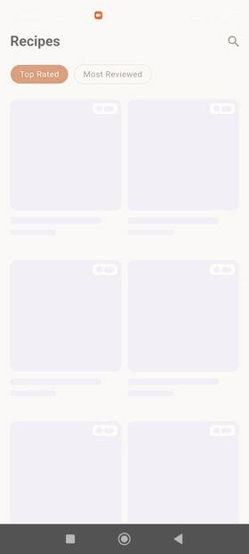

<h1 align="center">Flutter Clean Architecture Steps</h1>

<p align="center">
  A working Flutter app refactored from a messy single file into full Clean Architecture —<br/>
  one problem, one branch, one lesson at a time.
</p>

<p align="center">
  
  
  
  
</p>

<p align="center">
  
</p>

---

## The idea

Most Clean Architecture repos start clean. You get the finished folder
structure, a diagram, and no idea which real problem any of it solves.

This one starts messy on purpose — a genuinely working recipes app with
pagination, search, sorting, skeleton loading and pull-to-refresh, all
crammed into a single `main.dart` with hardcoded colors and zero error
handling. The kind of code a real deadline produces.

Then each branch fixes exactly one thing, and explains why.

**The app looks the same at the end as it does at the start.** That's the
point: architecture isn't what the user sees, it's what the next developer
inherits.

## How to use this repo

**Want the finished app?** You're on it — `main` always holds the latest
merged state.

**Want to learn from it?** Walk the branches in order:

```bash
git clone https://github.com/taha-elkholy/flutter-clean-architecture-steps.git
cd flutter-clean-architecture-steps
flutter pub get

# start at the beginning
git checkout 00-initial-dirty-state
```

Then for each branch:

1. Read `docs/<branch-name>.md` — what's wrong, why it matters, how it
   gets fixed, and where to read more.
2. Try fixing it yourself before looking at the diff.
3. Compare against the branch, then move to the next number.

Every branch carries the docs for itself and everything before it, so
whatever branch you're on, the folder reads as the story so far.

| Where | What you'll find |
|---|---|
| `main` | Latest state of the app |
| `00-initial-dirty-state` | The original messy version, frozen forever |
| `docs/` | One markdown file per step, with resources |

## The app

A recipes browser built on the free [DummyJSON Recipes API](https://dummyjson.com/docs/recipes)
— no API key, no signup, clone and run.

- Paginated grid with `limit` / `skip`
- Sorting toggle (Top Rated / Most Reviewed)
- Search
- Details screen
- Skeleton loading and pull-to-refresh

The list intentionally requests a lightweight payload, so the details
screen genuinely needs its own call — which makes the caching and data
layer lessons real instead of theoretical.

## Getting started

```bash
flutter pub get
flutter run
```

Requires the Flutter SDK. Runs on iOS and Android.

## License

MIT — use it, fork it, teach with it.

---

<p align="center">
  Built by <a href="https://github.com/taha-elkholy">Taha Elkholy</a> ·
  <a href="https://www.linkedin.com/in/taha-elkholy/">LinkedIn</a>
</p>